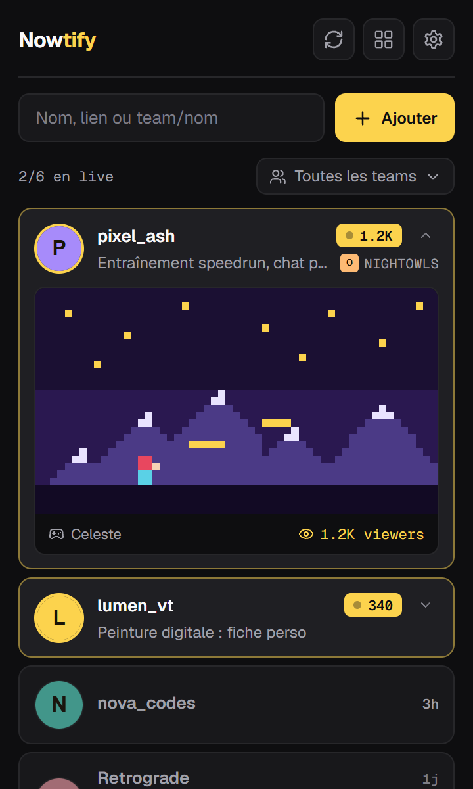
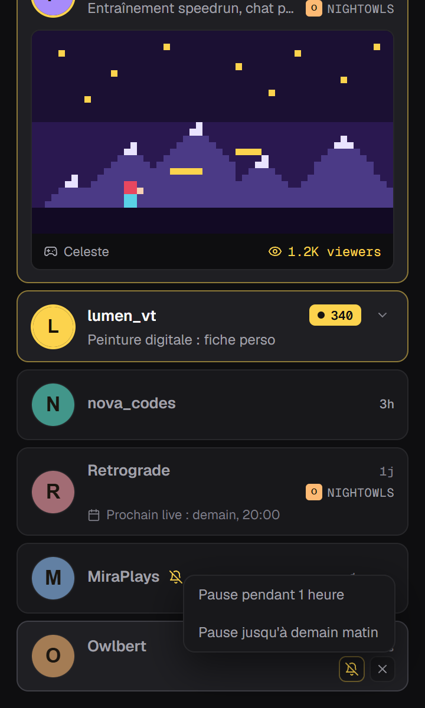
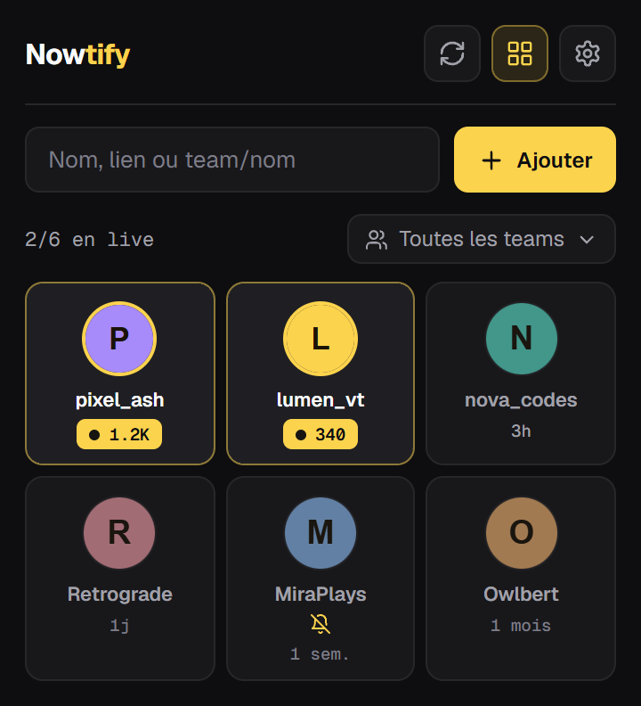
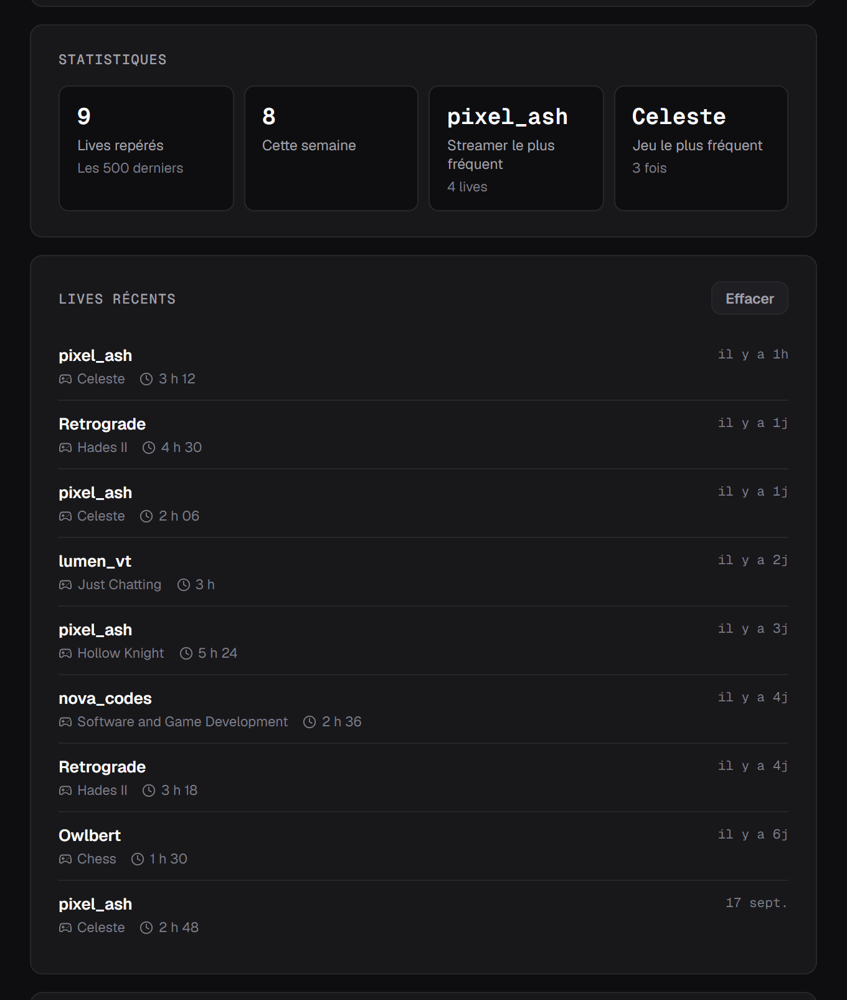

<div align="center">


# Nowtify

Une notification sur ton bureau dès qu'un de tes streamers Twitch lance son live.

[](https://chromewebstore.google.com/detail/nowtify/emjhkfephckipmmlecbkmpjphfjalkhg)
[](../../releases/latest)

<br />



</div>

<br />

Nowtify, c'est une petite extension Chrome qui surveille les chaînes Twitch que tu choisis et t'envoie une notification dès que l'une d'elles passe en live. Pas besoin de garder Twitch ouvert dans un onglet, ni d'espérer que la notif de l'appli ne se perde pas au milieu des autres.

Pas de compte à créer, pas de serveur entre toi et Twitch. Tout reste dans ton navigateur.

## 👀 Ce qu'il y a dedans

Clique sur l'icône et tu as ta liste. Ceux qui sont en live remontent en haut avec leur nombre de viewers, les autres affichent depuis combien de temps ils ont coupé leur dernier live. Le petit chiffre sur l'icône, c'est le nombre de streamers en live en ce moment.

Clique sur une carte pour ouvrir le stream. La petite flèche à côté du statut déplie un aperçu : la miniature du live, le jeu et les viewers.

Si un streamer hors ligne a rempli son planning Twitch, son prochain live s'affiche sous son nom.

## 👥 Des teams entières

Tape `team/` suivi du nom d'une team Twitch (par exemple `team/solary`) et tous ses membres arrivent d'un coup. Un filtre apparaît ensuite en haut de la liste pour n'afficher qu'une team.

Tu peux aussi coller un lien, `twitch.tv/zerator` ou `twitch.tv/team/solary`, ça marche pareil.

## 🔕 La pause par streamer

<div align="center">

&nbsp;&nbsp;

</div>

Quelqu'un lance trois lives par jour et tu n'as pas envie d'être prévenu à chaque fois ? Passe la souris sur sa carte, clique sur la cloche barrée, et coupe ses notifs pendant une heure ou jusqu'à demain matin. Il reste dans ta liste, avec une petite cloche jaune pour te rappeler qu'il est en pause.

Quand la liste s'allonge, le bouton en forme de grille passe en vue compacte : trois streamers par ligne, juste l'avatar, le nom et le statut.

## 📊 L'historique

<div align="center">

</div>

Chaque live repéré par Nowtify est noté, avec sa durée une fois qu'il est terminé. La page de réglages en tire quelques stats : le nombre de lives de la semaine, le streamer et le jeu que tu croises le plus.

C'est aussi là que tu exportes ta liste, tes réglages et ton historique dans un fichier, pour les récupérer sur un autre navigateur.

## 📥 Installation

1. Va sur la [page du Chrome Web Store](https://chromewebstore.google.com/detail/nowtify/emjhkfephckipmmlecbkmpjphfjalkhg) et clique sur « Ajouter à Chrome ».
2. Épingle l'icône : clique sur la pièce de puzzle en haut à droite de Chrome, puis sur la punaise à côté de Nowtify.
3. Ouvre la popup et clique sur « Connecter ». Une fenêtre Twitch s'ouvre, tu te connectes, c'est fait.
4. Ajoute tes streamers avec leur nom, leur lien, ou `team/nom` pour une team.

Nowtify vérifie toutes les 5 minutes qui est en live, et toutes les minutes dès que quelqu'un de ta liste l'est. Compte donc jusqu'à 5 minutes entre le début d'un live et la notification.

> [!NOTE]
> Edge, Brave et Vivaldi peuvent installer l'extension directement depuis le Chrome Web Store. Firefox et Safari, pas pour l'instant.

## 🔒 Et tes données ?

Ta liste, ton historique et tes réglages sont stockés par Chrome sur ta machine. L'extension ne parle qu'à Twitch : pour la connexion, pour savoir qui est en live, et pour afficher les avatars et les miniatures. Il n'y a aucun serveur à moi, aucun outil de stats, et même les polices sont incluses dans l'extension.

La connexion Twitch ne demande aucun droit sur ton compte. Le token ne peut lire que ce que tout le monde voit déjà sur Twitch, et il est révoqué quand tu te déconnectes.

Le détail complet est dans la [politique de confidentialité](https://nowtify.qyrn.dev/privacy.html).

## 🤔 Si ça coince

<details>
<summary><b>« Ta session Twitch a expiré »</b></summary>
<br />
Twitch a invalidé le token, ça arrive au bout d'un moment ou si tu changes ton mot de passe. Clique sur « Reconnecter » dans la popup.
</details>

<details>
<summary><b>Aucune notification n'apparaît</b></summary>
<br />
Vérifie dans l'ordre : que les notifications sont activées dans les réglages de Nowtify, que le streamer n'est pas en pause (cloche jaune à côté de son nom), et que Windows ou macOS laisse Chrome afficher des notifications. Sur Windows, le mode Ne pas déranger les bloque toutes.
</details>

<details>
<summary><b>« Aucune chaîne Twitch à ce nom »</b></summary>
<br />
Nowtify cherche le nom d'utilisateur exact, celui qui apparaît dans l'adresse de la chaîne. Le plus simple, c'est de copier le lien de la chaîne et de le coller dans le champ.
</details>

<details>
<summary><b>La notification arrive plusieurs minutes après le début du live</b></summary>
<br />
C'est normal : Chrome réveille l'extension toutes les 5 minutes au maximum. Et Chrome doit être ouvert, une fenêtre réduite suffit.
</details>

---

<details>
<summary>🛠️ <b>Pour bidouiller le code</b></summary>

<br />

WXT, Vite et TypeScript strict. Il faut Node 24+ et pnpm 10+.

```bash
pnpm install
pnpm dev          # lance Chrome avec l'extension, rechargée à chaque modif
pnpm typecheck
pnpm lint
pnpm test
pnpm build        # compile l'extension dans .output/chrome-mv3
pnpm zip          # génère .output/nowtify-x.y.z-chrome.zip
```

Pour la charger dans ton Chrome habituel : `pnpm build`, puis dans `chrome://extensions`, « Charger l'extension non empaquetée » sur le dossier `.output/chrome-mv3`. La racine du dépôt ne contient pas de `manifest.json`, WXT le génère au build.

Pour publier une version : monte `version` dans `package.json`, lance `pnpm zip`, envoie le zip sur le tableau de bord du Chrome Web Store, puis joins-le à une release GitHub.

| Dossier                    | Rôle                                                                   |
| -------------------------- | ---------------------------------------------------------------------- |
| `src/entrypoints`          | points d'entrée : service worker, popup, page de réglages              |
| `src/background`           | appels à l'API Twitch, connexion, IndexedDB, vérifs et notifications   |
| `src/popup`, `src/options` | interface de la popup et de la page de réglages                        |
| `src/shared`               | types, messages entre les pages et le worker, traductions, formatage   |
| `public`                   | icônes et traductions (`_locales/en`, `_locales/fr`)                   |
| `tests`                    | tests unitaires (Vitest)                                               |
| `landing`                  | le site [nowtify.qyrn.dev](https://nowtify.qyrn.dev), en HTML statique |

</details>

<br />

Sous [licence MIT](LICENSE). Fait par [qyrn](https://github.com/qyrn). Si Nowtify te rend service, tu peux passer dire merci sur [Ko-fi](https://ko-fi.com/qyrnsec).
